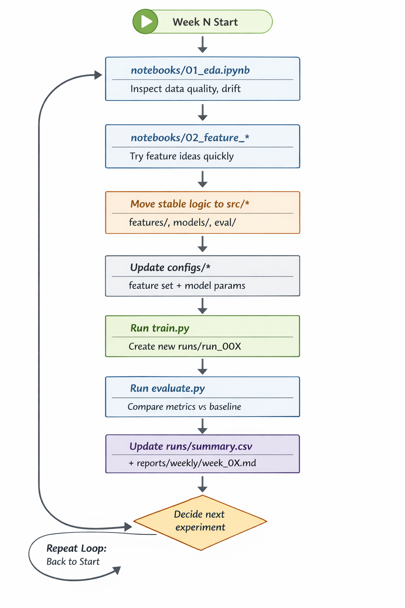

# ML Demo Repo Spine

This repository is a course-ready machine learning project spine focused on reproducibility and traceability.

## Project Structure

```text
ml_demo1/
├── data/
│   ├── raw/
│   ├── processed/
│   └── data_dictionary.md
├── src/
│   ├── features/
│   ├── models/
│   ├── eval/
│   ├── inference/
│   └── utils/
├── notebooks/
├── configs/
│   ├── data/
│   ├── features/
│   ├── models/
│   └── train/
├── runs/
├── reports/
├── train.py
├── evaluate.py
├── predict.py
├── smoke_test.py
└── requirements.txt
```

## Quickstart

1. Install dependencies:

```bash
pip install -r requirements.txt
```

2. Train a baseline model:

```bash
python train.py --config configs/train/default.yaml
```

3. Evaluate a trained run:

```bash
python evaluate.py --run-dir runs/run_001
```

4. Run inference on a CSV:

```bash
python predict.py --run-dir runs/run_001 --input-csv data/processed/inference_input.csv
```

5. Run a pipeline smoke test:

```bash
python smoke_test.py
```

## Workflow Map (Command -> Artifacts)

1. `train.py`

Command:

```bash
python train.py --config configs/train/default.yaml
```

Reads:
- `configs/train/default.yaml`
- `configs/data/default.yaml`
- `configs/features/default.yaml`
- `configs/models/baseline_logreg.yaml`
- `data/processed/train.csv` (auto-generated from sklearn demo dataset if missing)

Writes:
- `runs/run_001/model.joblib`
- `runs/run_001/metrics.json`
- `runs/run_001/params.json`
- `runs/run_001/predictions.csv`
- `runs/run_001/holdout.csv`
- `runs/summary.csv`

2. `evaluate.py`

Command:

```bash
python evaluate.py --run-dir runs/run_001 --target-col target
```

Reads:
- `runs/run_001/model.joblib`
- `runs/run_001/holdout.csv`

Writes:
- `runs/run_001/evaluation_metrics.json`

3. `predict.py`

Command:

```bash
python predict.py --run-dir runs/run_001 --input-csv <path_to_input.csv>
```

Reads:
- `runs/run_001/model.joblib`
- input CSV passed via `--input-csv`

Writes:
- `runs/run_001/predictions_inference.csv` (default)
- or custom file path from `--output-csv`

4. `smoke_test.py`

Command:

```bash
python smoke_test.py
```

Behavior:
- Checks whether `runs/run_001/model.joblib` exists.
- If missing, runs `train.py` automatically.
- Loads `runs/run_001/holdout.csv`, predicts on a small sample, and validates expected output columns.
- Prints pass/fail sanity result.

## Workflow Diagram


```text
notebooks/*  -> exploration only
src/*        -> reusable production logic
reports/*    -> human-readable findings and decisions
```

## Weekly Course Rhythm



## Reproducibility Checklist

- Keep `data/raw/` unchanged after ingest.
- Modify behavior through `configs/` before changing code.
- Use new run names (for example `run_002`) to avoid overwriting prior experiments.
- Record outcomes in `runs/summary.csv` and `reports/weekly/`.

## Notes

- Keep final reusable logic in `src/`, not in notebooks.
- Treat `data/raw/` as read-only.
- Store per-experiment artifacts under `runs/`.
